  &nbsp;
  &nbsp;
  &nbsp;
  




  <a href="https://github.com/kemalcalak/DialogTR-BackEnd"></a>
  <a href="https://github.com/kemalcalak/DialogTR-Mobile"></a>

  <a href="https://github.com/kemalcalak/NextJS-Template"></a>
  <a href="https://github.com/kemalcalak/Fastapi-Template"></a>


  <a href="https://medium.com/p/688f6d61a4c6"><code>cat ./backend-security.md</code></a> · published on <a href="https://medium.com/@kemalcalak">Medium</a>


  
  

  

